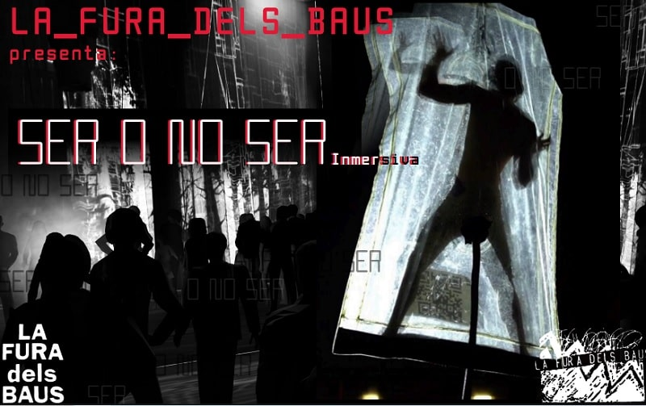
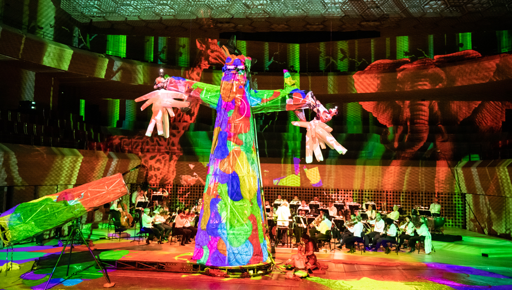
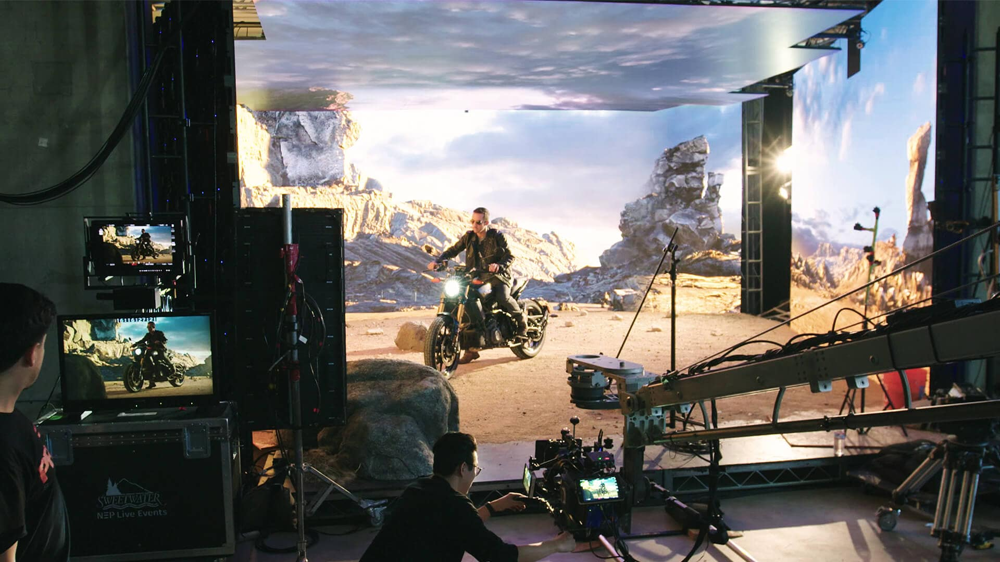
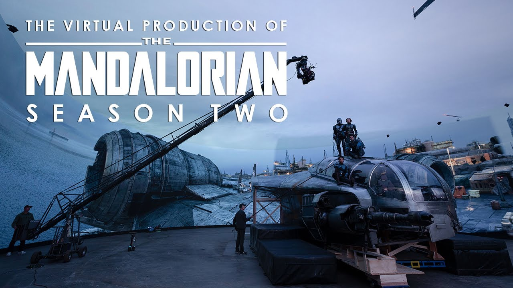

# PEC3: Manovich Reloaded - La Lógica de la Hibridación en la Cultura del Software

- **Autor:** Antonio Miguel García del Río
- **Fecha:** 17/12/2025
- **Asignatura:** UOC - Cultura Digital
- **Licencia:** NO LICENSE

---

## 1. Introducción: Cuando el Software tomó el mando

Ya no vivimos en la era de los "nuevos medios", sino en la de la **cultura del software**. Como explica Lev Manovich, el software ha dejado de ser una herramienta invisible para convertirse en el **motor creativo principal** y la interfaz con la que percibimos el mundo.

El concepto clave aquí no es la "multimedia" de los años 90 —esa simple yuxtaposición de texto e imagen que convivían como un *collage* sin tocarse— sino la **hibridación**. Gracias a que el ordenador funciona como un **metamedio**, las técnicas que antes estaban "atrapadas" en soportes físicos (la cámara de cine, la imprenta, el lienzo) se han convertido en algoritmos compatibles. Esto ha permitido una **remezclabilidad profunda** (*deep remixability*): ya no solo remezclamos contenidos, sino las técnicas y los lenguajes de medios anteriormente incompatibles para crear "nuevas especies" mediáticas.

A continuación, analizaremos dos casos donde esta "revolución de terciopelo" digital ha borrado las fronteras entre lo físico y lo virtual.

---

## 2. Caso 1: La Fura dels Baus - El Metamedio Escénico

**La Fura dels Baus** es mucho más que una compañía teatral; es un laboratorio de **digitalización del ritual**. Lo que empezó como teatro de calle basado en la "fricción" física ha evolucionado hacia un espectáculo de gran formato donde el software es el tejido mismo de la obra.

### Análisis: La Escena como Estructura de Datos
Desde la perspectiva de Manovich, La Fura ha transformado el escenario en un **metamedio**. Al digitalizar la escenografía con *video-mapping*, sensores y pantallas móviles, el espacio físico deja de ser rígido para convertirse en una **estructura de datos manipulable**.

1.  **Remezclabilidad Profunda:** En sus montajes de Wagner o Fausto, LFB integra el **lenguaje cinematográfico** (planos secuencia, montajes rápidos) directamente en la acción en vivo. La técnica de la *performance* corporal se hibrida con la animación generativa: el actor interactúa con avatares que responden a su movimiento en tiempo real.
2.  **La Estética de la Variabilidad:** Gracias a la **modularidad** de los paneles-pantalla, el espacio teatral puede cambiar de escala o perspectiva instantáneamente, aplicando el concepto de "papel mágico" de Alan Kay al entorno físico.
3.  **Escalabilidad Visceral:** La hibridación permite a La Fura **escalar la intensidad** del ritual atávico para una sociedad acostumbrada a la mediación de las pantallas, uniendo lo carnal con lo tecnológico de forma irreversible.
4. **Fusión de Disciplinas:** La compañía es claramente un paradigma de hibridación precisamente por su capacidad de combinar teatro, danza, música y tecnología digital en un único tejido escénico. No se trata de solo de teatro con música de fondo (lo que sería característico de la "multimedia" tradicional), sino de una integración de lenguajes donde la música también es parte de la narrativa misma.

---

  
  
<em>Haz clic para ver vídeo La Fura dels Baus (Ser o no ser)</em>

---

---

## 3. Caso 2: The Volume (Unreal Engine) - Bits y fotones en el Set

**The Volume**, el sistema de muros LED popularizado por series como *The Mandalorian*, representa la culminación del ordenador como metamedio universal. Aquí, el motor de videojuegos **Unreal Engine** sustituye al tradicional croma verde por un entorno 3D fotorrealista proyectado en tiempo real.

### Análisis: El Fin de la Postproducción
Este caso es el epítome de la hibridación porque borra la frontera entre los bits del software y los fotones del set físico.

1.  **Unreal Engine como Metamedio Universal:** El motor de juego actúa como una plataforma integradora que aglutina simulación física, óptica cinematográfica y renderizado 3D. Ya no hay distinción técnica entre "cine" y "videojuego"; ambos son variables de un mismo software.
2.  **Luz Interactiva como Puente:** El elemento más disruptivo es la **fusión físico-digital de la luz**. Las pantallas LED no solo muestran un paisaje, sino que **emiten luz real** que ilumina a los actores y genera reflejos orgánicos. Esto logra una coherencia visual donde es "prácticamente imposible distinguir lo real de lo virtual".
3.  **Remezclabilidad de Óptica y Algoritmos:** Se produce un remix profundo donde las propiedades físicas de la cámara (paralaje, profundidad de campo) se traducen en algoritmos mediante sistemas de *tracking* como *Live Link*. El fondo digital ajusta su perspectiva instantáneamente según el movimiento del director, creando una **forma variable** y continua.
4.  **Hibridación del Flujo de Trabajo:** El paradigma cambia de "arréglalo en post" a "arréglalo en pre". La postproducción se traslada al rodaje, hibridando los roles del cineasta y el programador en una **"nueva especie" estética**.

---

---

  <a href="https://www.youtube.com/watch?v=-gX4N5rDYeQ">
    
    
<em>Haz clic para ver vídeo de Unreal Engine</em>

  </a>

---

## 4. Conclusiones: La Disolución de los Medios

El análisis de La Fura dels Baus y The Volume confirma que el software ya no es solo una herramienta, sino el **motor creativo principal** de nuestra era. Los medios clásicos (tv, cine, teatro, música) se han disuelto en el metamedio ordenador, reapareciendo como simulaciones híbridas que expanden nuestras capacidades expresivas.

Esta hibridación no es una moda, sino una **transformación irreversible**. En un mundo de "modernidad líquida", las constantes del diseño han sido sustituidas por **variables**, haciendo que el cambio continuo sea la nueva norma cultural.

---

## 5. Referencias y Bibliografía

*   **Manovich, L.** (2013). *El Software toma el mando*. Barcelona: Editorial UOC.
*   **Fundación Épica La Fura dels Baus.** (s.f.). *About La Fura*. Material docente UOC [Fundación Épica](https://fundacionepica.org/).
*   **Unreal Engine.** (2022). *The Volume - Unreal Engine*. Análisis de Producción Virtual [Unreal](https://www.unrealengine.com/en-US/uses/film-television).
*   **Gea Megías, M.** (2022). *Herramientas y metodología crowdsourcing para la participación y creación colectiva de conocimiento abierto*.

---

## 6. Declaración de Uso de IA
Para la elaboración de esta versión definitiva se ha utilizado la asistencia de un modelo de lenguaje, Gemini, siguiendo las directrices de la UOC.
*   **Uso:** Síntesis de borradores previos, estructuración de Markdown y ajuste de tono estilístico inspirado en la obra de Manovich.
*   **Referencia:** La IA llega al aprendizaje en la UOC [UOC-GEMINI](https://campus.uoc.edu/estudiant/mes-uoc/es/actualitat/noticies/actualitat/gemini_resum.html)